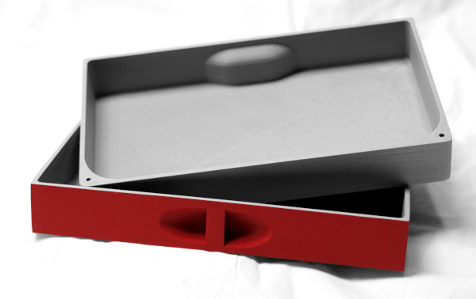

# Assortment drawers for the DMOTE application

Every item in your home and office needs a good set of assortment drawers to go
inside it. Transform your computer keyboard into a cash register or a sewing
kit with this tiny spin-off application.

In its current version, `dmote-drawer` is a hard-coded design for a type of
drawer that fits the optional assortment cabinet feature of the Concertina, a
type of computer keyboard, as the Concertina is defined by bundled
configuration files that come with version 0.6.0 of the [DMOTE
application](https://github.com/veikman/dactyl-keyboard).

## Usage

Use `lein run` with command-line arguments to generate files of OpenSCAD code
under `output/scad` and, optionally, STL files for slicing and 3D printing.

## License

Copyright © 2020 Viktor Eikman

This software is distributed under the [Eclipse Public License](LICENSE-EPL)
(EPL) v2.0 or any later version thereof. This software may also be made
available under the [GNU General Public License](LICENSE-GPL) (GPL), v3.0 or
any later version thereof, as a secondary license hereby granted under the
terms of the EPL.
